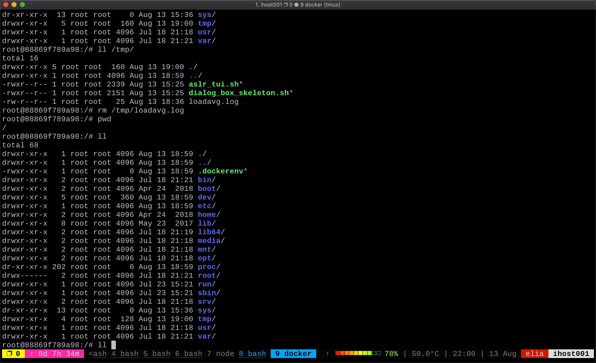

# Description

A command runner TUI,

The user chooses option from the menu build upon `dialog` Text User Interface.
Each option is a "command" to execute.

Examples for more "dialog" implementations - 
https://invisible-island.net/dialog/dialog-figures.html